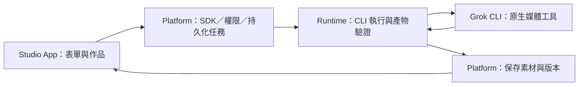

# SPEC-003: Media Studio Vertical Slice

## Metadata

| Field | Value |
|-------|-------|
| Status | Draft — implementation and live CLI validation not started |
| Owner | cats-apps; Platform owns SDK/data delivery, Runtime owns CLI execution |
| Reviewer | Not assigned; independent review pending |
| Related decision | [ADR-002](../decisions/002-cli-backed-media-studio-vertical-slice.md) |
| Working identity | Cats Studio / `studio` / `cats.studio`; freeze before package/data creation |

## Summary

提供一個 Cats App，讓使用者透過表單與作品預覽，完成 Grok CLI 的生圖、
修圖與圖生短片。驗收包含實際檔案交付、作品版本、背景任務，以及重新開啟
App／host 後保存的作品。CLI 能力暫依使用者提供的 spike 自述規劃，實測另行完成。

## Goals

- 一條可交付的流程：描述生圖 → 修改 → 選圖生短片 → 預覽／下載 → 重開後取回。
- 不熟悉 CLI 的使用者能知道該填什麼、目前在做什麼、失敗後如何繼續。
- 由真正安裝的 `.catsapp` 經公開 SDK 執行，保持 App／host／Runtime 分工。
- 保存原圖、修改版與影片的來源關係，不因頁面離開或 App 更新失去作品。

## Non-Goals

- 多 provider、自動 fallback、API-key 生成服務、第三方生成 MCP。
- `reference_to_video`、多參考圖／語音、純文字直出影片、長片／時間軸剪輯。
- 局部遮罩修圖、批量生成、去背、超解析度、社群發布、協作或雲端同步。
- 精確像素／seed／模型 ID 的保證、生成品質或「訂閱內免費」保證。
- 新建一般任務系統、公開第三方執行平台或 App marketplace。
- 本次文件工作不包含功能實作、live generation、版本調整或發行。

## User Stories

- 我想描述一張圖，看到成品後再決定要不要修改或做成影片。
- 我想用自己的照片作為起點，修改後仍能回到原始版本。
- 我想把選定的圖片做成短片，知道影片是從哪一版圖片產生。
- 我想先去其他頁面，回來後仍看得到任務與作品，不必重做。

## Requirements

### Functional Requirements

| ID | Requirement |
|----|-------------|
| FR-01 | App 從 Lobby 開啟；首次使用檢查 host 能力、已設定的 Grok instance 與執行可用性。缺少登入／安裝時引導至現有設定流程。開頁、讀作品與刷新狀態不觸發生成。 |
| FR-02 | 生圖輸入為描述及 1:1 比例；風格／用途可做成填入描述的快捷選項。不得宣稱能指定精確像素、模型或最低價格。首版一次提交一個生成意圖，呈現實際輸出尺寸。 |
| FR-03 | 可匯入一張 PNG／JPEG／WebP 作為素材，或選取已保存的圖片版本。host 驗證真實格式、解碼及大小限制後回傳素材 ID；不把使用者原始路徑交給 renderer／CLI 作任意讀取。 |
| FR-04 | 修圖必須有明確的來源素材與修改描述；輸出為新版本，原檔不覆寫。支援原圖／修改版比較及再次選取任一已保存圖片作為下一步。 |
| FR-05 | 選定一張圖片及動作／運鏡描述後，才能提交圖生影片。首版目標為 6 秒／480p；只有在相同 CLI 執行方式驗證通過後才啟用。實際時長與尺寸以產物檢查結果呈現。 |
| FR-06 | 每一步有獨立執行按鈕，生圖完成後不自動修圖或生影片。顯示所用 Grok instance；未知費用／額度保持未知，已知的限制在提交前顯示。 |
| FR-07 | 提交回傳持久化任務 ID。重複點擊、網路重送與重新連線不能為同一次提交建立多個生成；使用者選「再試一次」才建立新 attempt，並保留與原任務的關係。 |
| FR-08 | 顯示排隊、執行、保存產物、成功、失敗、已取消或中斷待確認。缺少進度比例時只顯示階段與已等待時間，不製造百分比。關閉頁面不取消工作。 |
| FR-09 | 成功必須同時具備相符的執行結果、有效媒體與保存成功。無檔案、空檔、錯誤格式、參數不符或無法解碼不得標記成功；模型文字／退出碼不能取代驗證。 |
| FR-10 | 作品庫顯示縮圖、類型、建立時間、任務狀態與版本關係。圖片可預覽、影片可播放／seek，兩者可下載；大檔交付不塞入一般 SDK JSON 回應。 |
| FR-11 | 保存描述、要求參數、實際 metadata、provider／CLI 版本、run 與素材來源。可由作品回看設定、複用為新任務；CLI 未回報的生成模型 ID 保持未知。 |
| FR-12 | 重開 App 可找回進行中任務與作品；host 重啟後可取得已完成作品。無法確認的執行狀態標成中斷待確認，不自動重新呼叫生成。 |
| FR-13 | 登入、額度、privacy、拒絕生成、逾時、產物無效及磁碟不足須有不同且可理解的錯誤。保留輸入以便修正或重試；原始 stderr／憑證不送進 App。 |
| FR-14 | 使用者可取消排隊或執行中的任務。取消與完成競爭時，以持久化終態為準；不能宣稱取消已退費，也不在取消後隱藏地自動重跑。 |

### Capability and Parameter Baseline

下表是待驗證的首版目標，不是目前支援宣告。能力需綁定 CLI 版本、OS、
instance／執行 transport 與相容 profile；改版或條件不符時回報未知／不可用。
初次驗證可由受控的版本相容紀錄提供，不能在使用者每次開頁時花額度探測。

| Operation | Planned native tool | First acceptance combination |
|-----------|---------------------|------------------------------|
| `image.generate` | `image_gen` | 文字 → 1:1 圖片，記錄實際像素 |
| `image.edit` | `image_edit` | 一張已保存／匯入圖片 + 修改描述 → 新圖片 |
| `video.animate` | `image_to_video` | 選定圖片 → 6 秒／480p 短片 |

工具使用、輸入傳遞、輸出位置與控制參數都要由非互動實測確認。若 CLI
把產物放在 session 目錄而非指定 workspace，Runtime 必須根據該次執行的
可信事件辨識與驗證來源，再交付至 host；不得以掃描整個 home 目錄找檔案代替。
6 秒／480p 的解析度解讀、容許的編碼時長誤差及播放 codec 在 Phase 0 固定。
額外比例、10 秒、720p 等即使 CLI 宣稱支援，也不阻擋首版驗收。

### Job Lifecycle and Recovery

標準成功路徑為 `queued → running → collecting → succeeded`。
`failed`、`cancelled` 與 `interrupted` 必須帶原因與可用的下一步。
取消請求先記為 `cancelling`；不能只停止頁面輪詢就顯示「已取消」。

- Platform 在啟動 CLI 前持久化提交 ID 與 request fingerprint。
  同一 App／使用者下相同 ID 與內容回傳原任務；相同 ID 搭配不同內容拒絕。
- 首版每個 Grok instance 同時只執行一個本 App 的生成，排隊有上限；
  Runtime 既有整體執行限制仍適用。提交確認不等待生成結束。
- 生成逾時、斷線或 host crash 之後先查詢既有 run。CLI 沒有可恢復查詢時，
  停止不確定的執行並記為 `interrupted`；不得假設上游沒有執行或沒有計費。
- CLI 已產出而 host 尚未保存時，允許從同一已驗證產物重新收取，不能因此
  再呼叫生成。產物需保留到交付確認或明確失敗處理，不能先清掉工作目錄。
- 明確取消後遲到的結果不覆寫既有終態。下載／預覽失敗可重新讀取，不生成新檔。
- App disable／uninstall 撤銷新呼叫與素材存取、取消排隊並要求停止進行中工作；
  不自動刪除作品。重新 enable 不自動重送。單純離開頁面不套用此取消規則。

### Non-Functional Requirements

- **執行邊界**：App 只傳 typed input／素材 ID；Runtime 管理 CLI 與其登入。
  不讀取 provider 憑證、不提供通用 command／URL proxy。
- **素材邊界**：只接收該次 run 的產物；檢查真實路徑、symlink／reparse
  escape、媒體格式、檔案大小與解碼限制。輸入採 host 保存的快照，不能讓
  CLI 覆寫使用者原檔。首版不接受 SVG／HTML／任意遠端 URL 作為媒體。
- **權限與隔離**：host 綁定 enabled App、version 與使用者；素材與任務 ID
  不能跨 App／使用者讀取。完成回應及後續媒體讀取均重新檢查存取權。
  已下載的 bytes 無法因撤權追回，不能宣稱能做到。
- **資源界線**：Phase 1 固定 prompt 長度、輸入／輸出 bytes、像素／解碼、
  queue、執行時間、輪詢頻率與作品列表分頁上限；host／Runtime 執行限制，
  renderer 驗證只是即時回饋。超限回報原因並保留既有作品。
- **持久化**：作品資料與媒體在 replaceable package 之外；先完成檔案驗證與
  原子保存，再提交可見作品記錄。失敗不得留下「成功但無檔案」的記錄。
  清理 CLI session／App 套件不影響已保存的作品。
- **升級**：格式有 schemaVersion；沿用已驗證的 host 儲存／migration 機制。
  若既有 schema 變動，需驗證、備份、原子替換與失敗復原，不 reset 使用者資料。
- **UI**：提供繁體中文主流程、鍵盤操作、具名按鈕、可見焦點與錯誤提示。
  桌面與窄視窗均能完成操作；影片不預設自動播放，作品狀態不只用顏色表示。
- **離線**：已保存作品與設定可讀；不能生成時顯示不可用，恢復連線不自動提交。

## Design Overview

### Proposed App Contract

以下是需由 owner 固定的契約語意，名稱為提案；不是 SDK 1.2 的現有 methods。

| Surface | Required behavior |
|---------|-------------------|
| `capabilities.get` | 回傳受支援動作／參數、target readiness 與不可用原因；不做付費探測 |
| `assets.import` | 接收使用者選定圖片的受限 bytes，驗證後保存並回傳 asset ID |
| `jobs.submit` | 接收 request ID、動作、描述、參數、來源 asset ID、既有 provider target reference；回傳持久化 job ID |
| `jobs.get/list/cancel` | 取得、列出或取消該 App 的任務；回應含狀態、階段、錯誤及 output asset IDs |
| `works.list/get` | 分頁取得作品、版本 lineage、來源參數與實際 metadata |
| `assets.preview/export` | 以受控 handle 提供圖片／影片與下載；不暴露任意本機路徑或 API key |

Platform 固定執行、讀取、匯入／匯出等 capability grant 與 SDK wire format；
可重用一般 jobs/assets 基礎，但只能接收這三個 allowlisted 動作。
目前 renderer 的隔離／CSP 與 SDK 小回應模型須實際驗證媒體傳輸方案，
包含影片 seek／Range 或等價 bounded streaming、生命週期與撤權。

### Data Ownership

| Owner | Authoritative data |
|-------|--------------------|
| cats-apps | UI 表單、選取與比較狀態；不成為執行／作品的唯一持久化位置 |
| cats-platform | App 身分／權限、Core task/run 對應、request 去重、作品與版本關係、已保存媒體與存取 |
| cats-runtime | CLI session／執行 attempt、原生事件、provider 錯誤、產物來源與驗證結果 |

作品版本最少包含 `assetId`、`workId`、`parentAssetId`、來源 `runId`、類型、
建立時間、內容摘要雜湊、實際 MIME／bytes／寬高，影片另有時長。
匯入素材的 `runId` 為空。任務保存要求參數與實際結果的區別；provider 未回傳的
欄位為 unknown。Phase 1 對應現有 Core artifact／run schema，避免重複權威記錄。

## Acceptance

| ID | Scenario | Pass condition |
|----|----------|----------------|
| AC-01 | 真正安裝的 App | 在隔離 registry 從 `.catsapp` 啟動，無需 App source／dev server；公開 SDK 完成握手，unsupported host 顯示明確原因 |
| AC-02 | 一條真實 CLI 流程 | 經 App／host／Runtime 生成 I1、修改成 I2、由選定 I2 生成 V1；三個動作都有可追溯事件與有效產物，V1 符合驗證後的 6 秒／480p 契約 |
| AC-03 | 匯入與版本 | 本機匯入圖片可修圖／生成短片；原圖不變，I1／I2／V1 來源正確，修改結果可比較 |
| AC-04 | 預覽與下載 | 圖片可見、影片可播放與 seek；匯出 bytes 與保存產物雜湊相符 |
| AC-05 | 離頁與重啟 | 執行中離頁後可接續查看；host 重啟仍有作品，CLI session 清理後作品可讀；未知執行不自動重送 |
| AC-06 | 去重／取消／重試 | 重複提交只產生一個 run；同 key 不同 payload 被拒絕；取消競爭不覆寫終態；手動重試可追溯至原任務 |
| AC-07 | 失敗仍可信 | 登入／額度／privacy／逾時／拒絕／無效產物／磁碟不足各有正確狀態，不虛報成功，不隱藏地換 provider／改 privacy／重複生成 |
| AC-08 | 安全與生命週期 | 非法路徑、跨 App 素材、超限檔案被拒；disable 撤銷後續存取與執行，App 更新保留資料；schema 變更有失敗復原測試 |
| AC-09 | 可用性與相容 | 繁中、鍵盤、窄視窗與離線作品可讀；既有 Usage／SDK 契約通過回歸 |

Fixtures 可驗證 host、UI 與錯誤流程，但 AC-02 需要實際 CLI 產物。
所有平台的支援宣告以各自原生驗證為準；第一條 live 驗收先在 Windows native
進行，macOS／Linux／WSL／Docker 未驗證時不得一併標為已支援。

## Dependencies

- [App package specification](SPEC-001-official-utility-app-packages.md)與
  [Platform hosting baseline](../../../cats-platform/docs/specs/SPEC-115-versioned-official-app-packages-and-telemetry-bridge.md)。
- Platform 提供可執行 SDK、媒體存取與持久化任務介面，並記錄 owner ADR／SPEC／PLAN。
- Runtime 證明 Grok headless 的媒體能力、事件與產物收取，並記錄 owner 契約與 fixtures。
- 使用者已設定的 Grok CLI／帳號；本規劃不代替後續 live probe 的範圍與額度安排。

## Open Questions

- [ ] Phase 0：Grok headless 是否具備三個必要工具、媒體輸入與產物事件？
      工具 allowlist／執行限制如何落實？阻擋時需回報切片受阻。
- [ ] Phase 0：確認實際檔案格式／codec、6 秒容差、480p 語意、privacy 條件與
      可觀測用量；沒有資料時維持 unknown。
- [ ] Phase 1：定案 App 名稱／ID、Core 記錄對應、媒體傳輸、具體資源上限、
      權限名稱及 SDK 相容性邊界。不得讓未定案項目被當成現成 API。

## References

- [ADR-002](../decisions/002-cli-backed-media-studio-vertical-slice.md)
- [PLAN-003](../plans/PLAN-003-media-studio-vertical-slice.md)
- [Original test report](../research/2025-09-12-five-cli-media-final-report.md)

*Created: 2026-09-28*
*Related Plan: [PLAN-003](../plans/PLAN-003-media-studio-vertical-slice.md)*
